# Schema migration?

## golang migrate

### scoop (windows's uncomfortable point) issue

#### What does Scoop do?
Scoop installs programs you know and love, from the command line with a minimal amount of friction. It:

Eliminates permission popup windows
Hides GUI wizard-style installers
Prevents PATH pollution from installing lots of programs
Avoids unexpected side-effects from installing and uninstalling programs
Finds and installs dependencies automatically
Performs all the extra setup steps itself to get a working program
https://github.com/ScoopInstaller/Install#readme

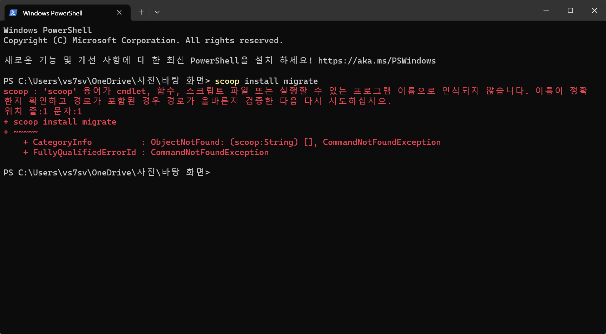

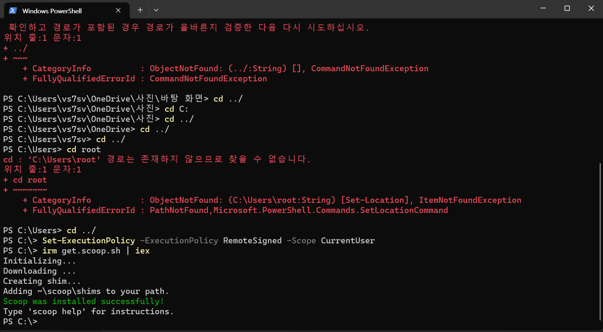

### 스쿱도 해결했으니 다시 migrate 설치

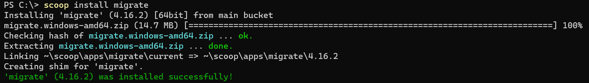

사용법은 다음과 같이 나와있는데,
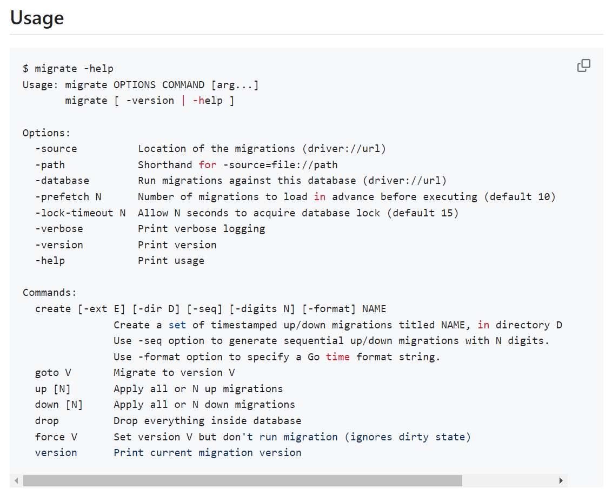

create, up, down 정도를 주로 사용한다고 한다.. 그게 뭔데..?

일단 db migration이 뭔지 살펴보자

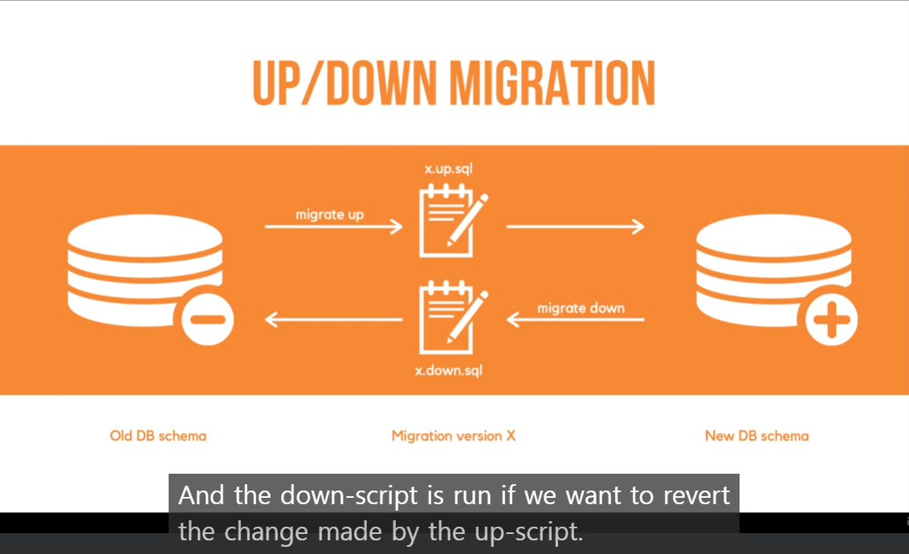

up > run sequentially by the order of their prefix version

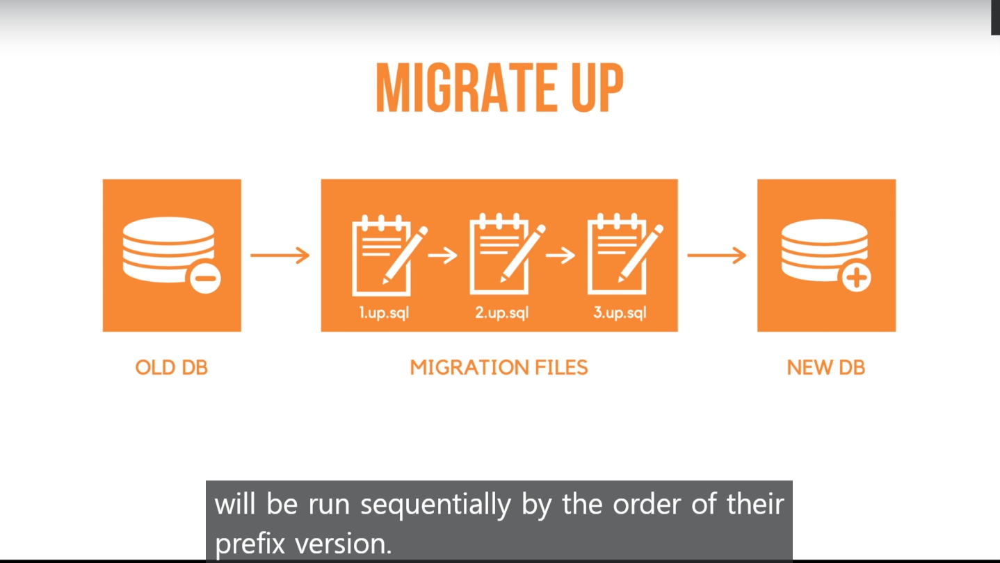

down > run sequentially by the reverse order of their prefix version

docker가 켜져있는지 확인하다가 다시 켜야했는데, 명령어 다시 한 번 익힘.
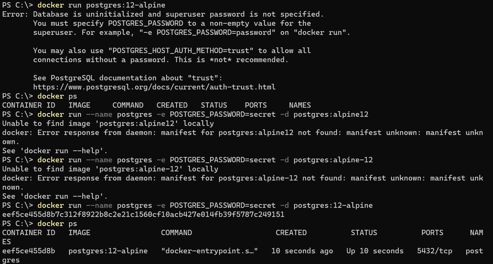

도커에서 쉘이란? > 도커문서확인

shell을 통해 docker를 이용하여 container cli를 조작할 수 있게 되었다. 이제 cli에 입력하듯이 명령어를 입력해서 컨테이너에 디비를 만들고 스키마를 그리면 된다.

한 줄 요약
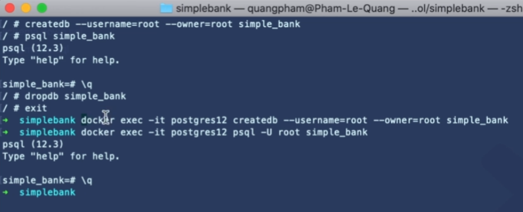

팀워크를 위한 명령어 파일
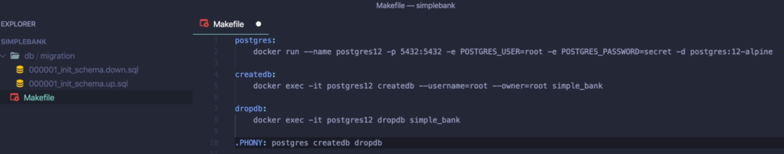
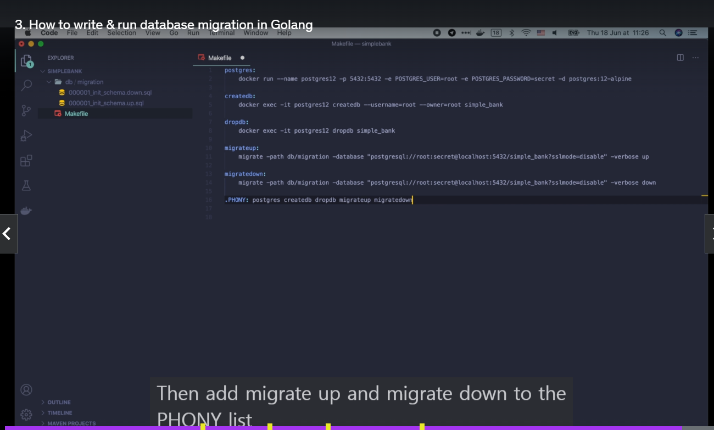

# CRUD in back-end

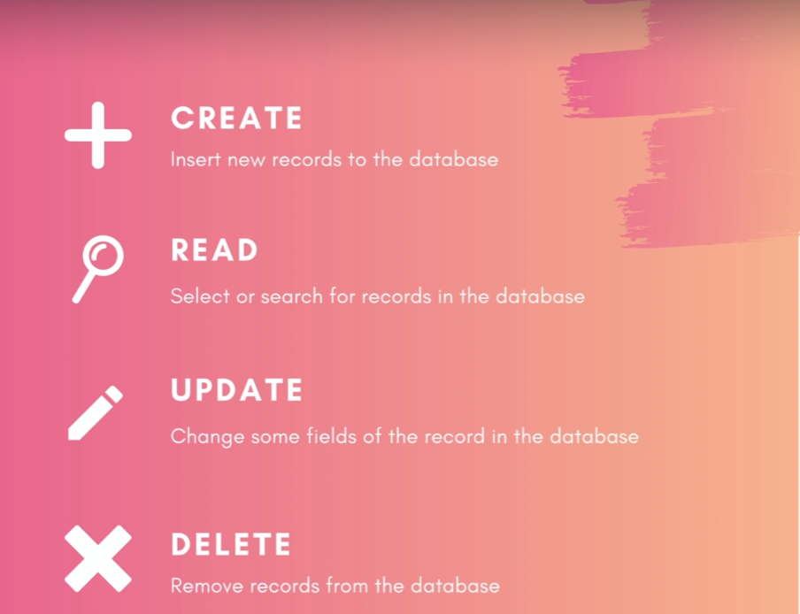

