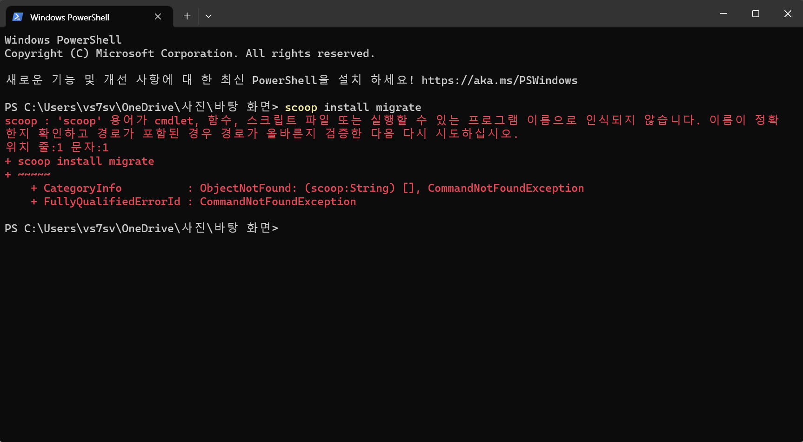
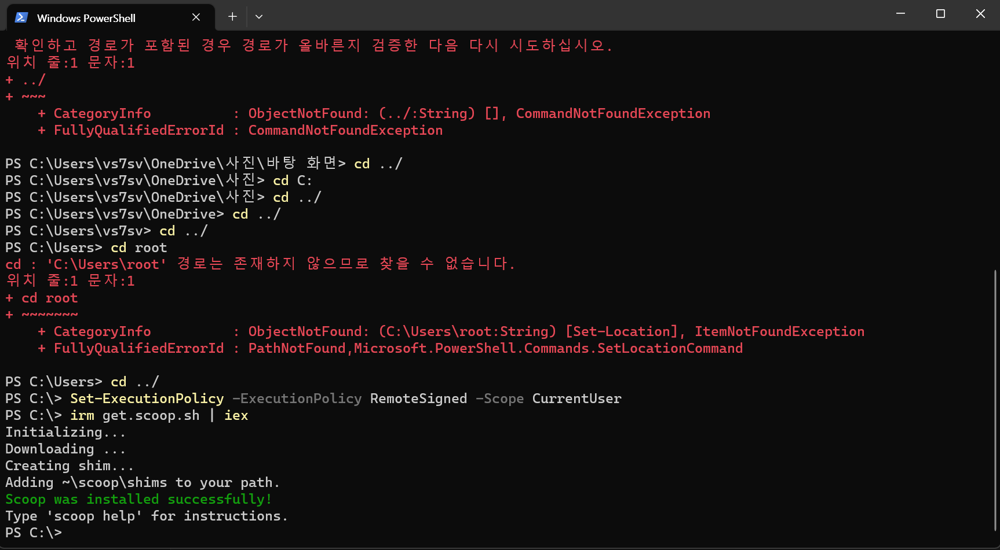

# Schema migration?

## golang migrate

### scoop (windows's uncomfortable point) issue

#### What does Scoop do?
Scoop installs programs you know and love, from the command line with a minimal amount of friction. It:

Eliminates permission popup windows
Hides GUI wizard-style installers
Prevents PATH pollution from installing lots of programs
Avoids unexpected side-effects from installing and uninstalling programs
Finds and installs dependencies automatically
Performs all the extra setup steps itself to get a working program
https://github.com/ScoopInstaller/Install#readme

### 스쿱도 해결했으니 다시 migrate 설치

