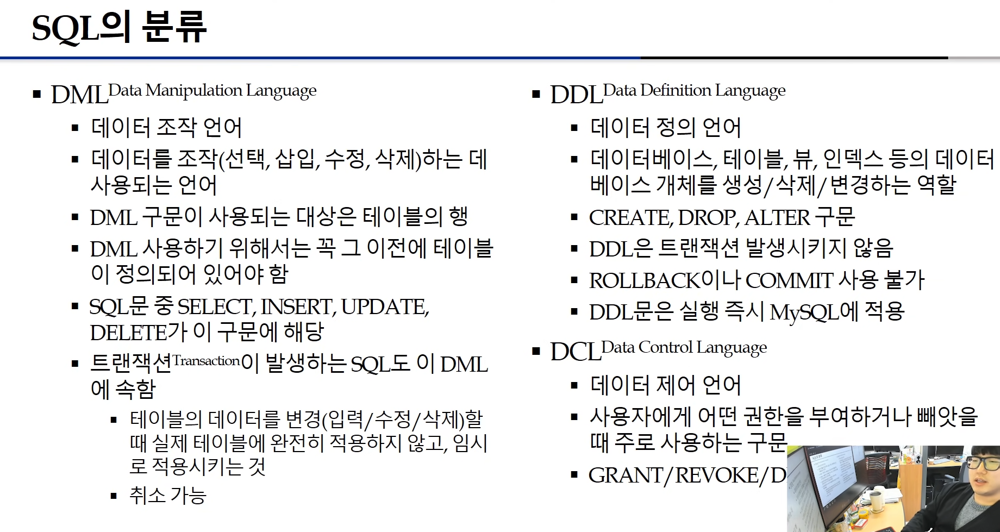
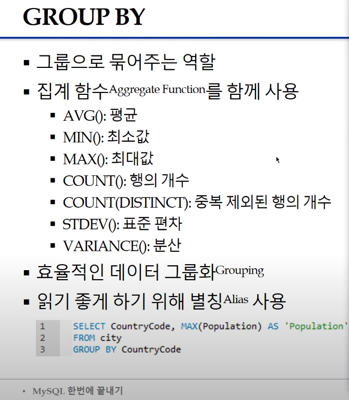
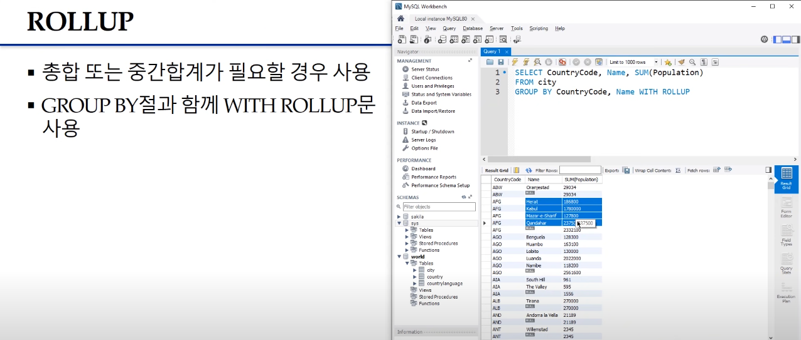
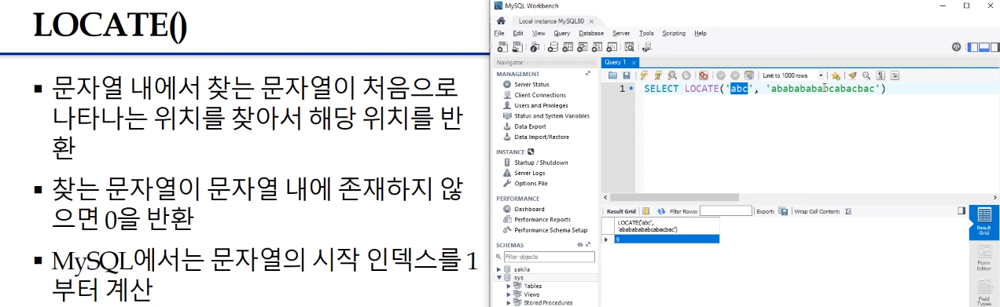
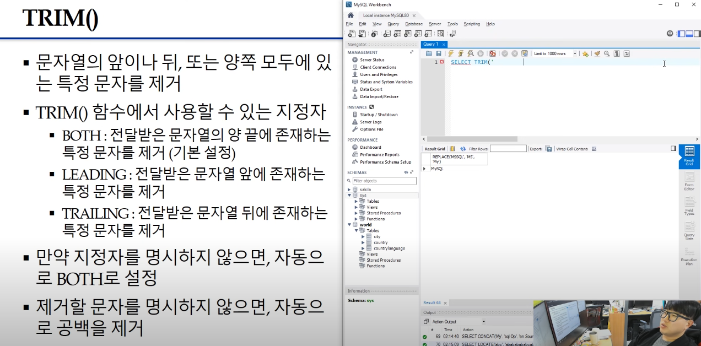
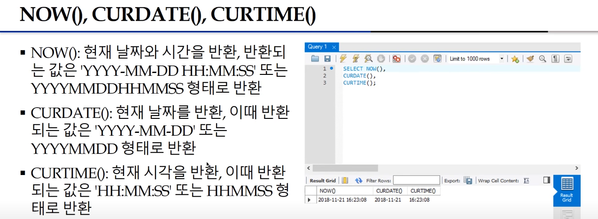
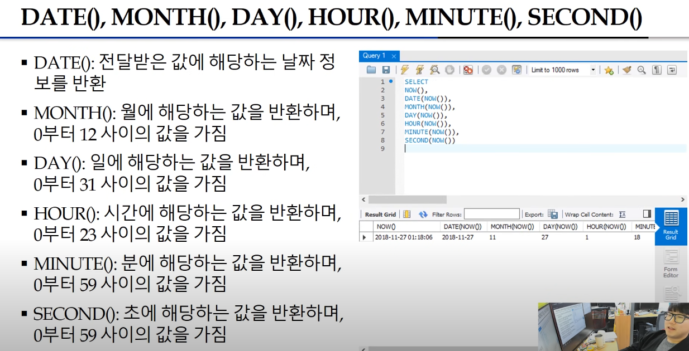
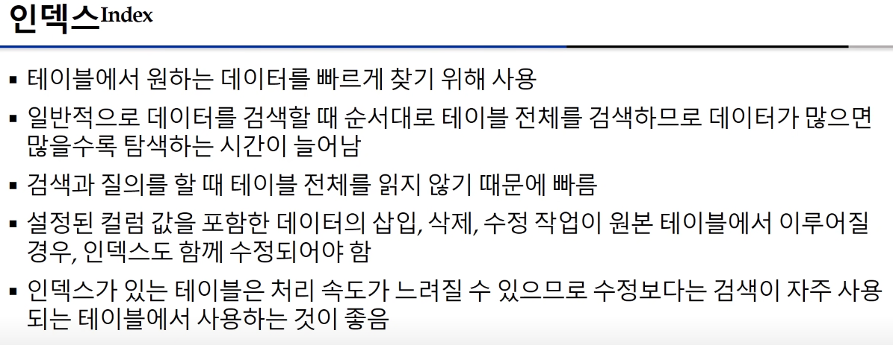
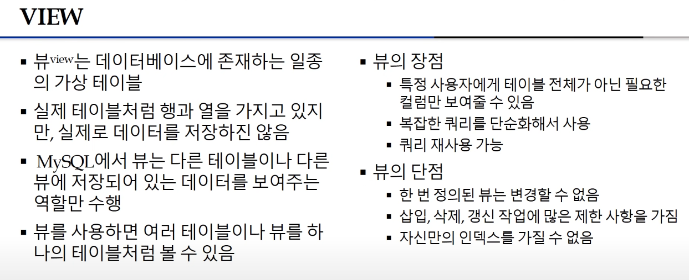

- MySQL 한 번에 끝내기
- MySQL 소개
- MySQL 

1. 다운로드

오라클 계정 필요. > 프리티어 가입 오류가 많다고 함. 가입실패...

실행 = ctrl enter

SHOW DATABASE

USE db_name

SHOW TABLES (STATUS)

DESC(RIBE) table_name

SELECT * FROM table_name
'*' : all을 의미

SELECT field_name 
FROM table_name
WHERE 조건식

여기에 관계연산자 사용가능
OR, AND, NOT, 조건연산자 등
BETWEEN ... AND ... 도 사용가능

IN()
LIKE() - %,_

Sub Query
SELECT * FROM table_name
WHERE CountryCode = (SELECT CountryCode FROM city WHERE Name = Seoul))

SELECT * FROM table_name
WHERE Population > ANY = (SELECT Population FROM city WHERE Name = 'Seoul'))

ORDER BY Population (DESC)

정렬, 오름차순이 기본.

DISTINCT

LIMIT 10

GROUP BY CountryCode
집계함수를 함께사용

SELECT CountryCode, AVG(Population) AS 'Average' FROM city GROUP BY CountryCode

HAVING

SELECT CountryCode, MAX(Population) FROM city 
GROUP BY CountryCode
HAVING MAX(Population) > 8000000

ROLLUP - 총합 또는 중간합계가 필요할 경우 사용
GROUP BY 절과 함께 WITH ROLLUP문 사용

JOIN 은 데이터베이스 내의 여러 테이블에서 가져온 레코드를 조합하여 하나의 테이블이나 결과 집합으로 표현

SELECT * 
FROM city
JOIN country ON city.countryCode = country.Code
JOIN countrylanguage ON city.countryCode = countrylanguage.CountryCode

MySQL 내장함수

LENGTH()
CONCAT()
LOCATE()

LEFT(),RIGHT()

LOWER(),UPPER()

REPLACE()

TRIM()

FORMAT() 숫자타입 쉼표 형식으로 변환, 문자열로 반환됨, 두번째 인수는 반올림할 소수부분 자릿수

FLOOR(), CEIL(), ROUND()

SQRT(), POW(), EXP(), LOG(),

SIN(), COS(), TAN(),

ABS(), RAND() - 0.0 보다 크거나 같고 1.0보다 작은 하나의 실수를 무작위로 생성.

NOW(), CURDATE(), CURTIME()

DATE(), MONTH(), DAY(), HOUR(), MINUTE(), SECOND(),

DAYOFWEEK(), DAYOFMONTH(), DAYOFYEAR()

DATE_FORMAT() 전달받은 형식에 맞춰 날짜와 시간정보를 문자열로 반환

SQL 고급
**CREATE TABLE** city2 **AS SELECT** * FROM city1
동일한 테이블 생성

**CREATE DATABASE** useon;
화면에서 클릭으로 GUI를 통해서 table 만들 수도 있음. >> 결국 sql query로 변환해줌.

ALTER TABLE - ALTER TABLE과 ADD 사용시 테이블에 컬럼 추가할 수 있고, MODIFY문을 사용하면, 컬럼타입을 변경할 수 있음.

INDEX

CREATE INDEX Col1Idx
ON test (col1);

SHOW INDEX FROM test;

CREATE UNIQUE INDEX Col1Idx
ON test (col1);

SHOW INDEX FROM test;

FULLTEXT INDEX - 일반적 인덱스와 달리 매우 빠르게 테이블의 모든 텍스트 컬럼을 검색
ALTER TABLE test
ADD FULLTEXT Col3Idx(col3);

SHOW INDEX FROM test;

INDEX 삭제

ALTER TABLE test
DROP INDEX Col3Idx;
SHOW INDEX FROM test;

DROP INDEX만 단독으로 사용해서도 삭제가능
DROP INDEX Col2Idx;

VIEW

